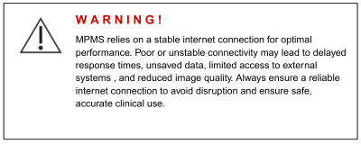
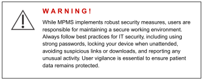
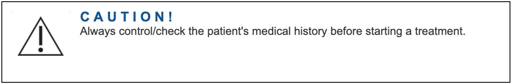
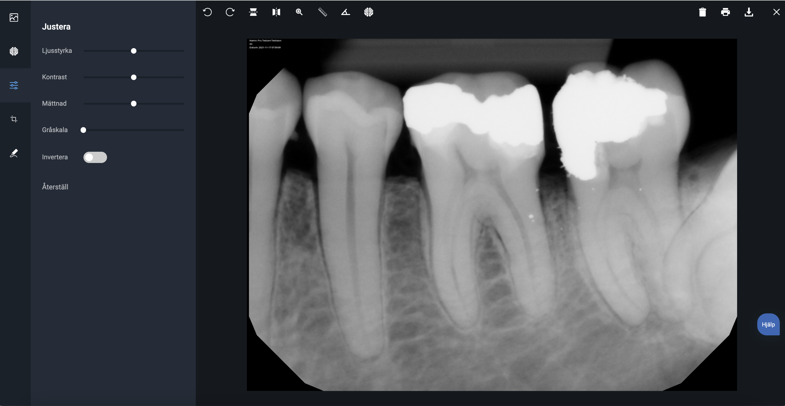
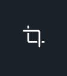

# Muntra Patient Management System (“MPMS”) Bruksanvisning (Instructions For Use)

| Dok.nr. | Dato for første utgave | Siste utgave nr. | Dato for siste utgave |
| ------- | ---------------------- | ---------------- | --------------------- |
| 15-01   | 23. okt. 2019          | Rev5             | 22. feb. 2026         |

En fysisk kopi av dette dokumentet skal betraktes som en «ukontrollert kopi». Innehaveren av en ukontrollert kopi er ansvarlig for å kontrollere dokumentets riktighet. Muntras interne håndtering og gjennomgang av dokumenter gjøres kun i den elektroniske versjonen.

Hvis du ønsker en utskrevet versjon av bruksanvisningen (IFU), kontakt Muntra på e-post support@muntra.se. Utskrifter leveres kostnadsfritt på forespørsel.

Hvis du trenger dette dokumentet på et annet språk, kontakt oss på support@muntra.se. Vi leverer en oversatt versjon så snart som mulig, i samsvar med lokale krav.

## 1. Merking og symboler

**Publiseringsdato:** 2026-02-22

**Revisjonsnummer:** Rev5

|                              |                                                                                                                                                                                                                                                   |
| ---------------------------- | ------------------------------------------------------------------------------------------------------------------------------------------------------------------------------------------------------------------------------------------------- |
|            | MPMS er et medisinsk utstyr, CE-merket i samsvar med forordning (EU) 2017/745 (MDR).                                                                                                                                                             |
|  | **Produsent:** Muntra AB Narvavägen 12 115 22 Stockholm Sverige  Telefon: +46 (0)8-40 90 68 90 E-post: support@muntra.se Nettsted: https://muntra.se  **Produksjonsdato** vises i programvaren. |
|           | **Les alle instruksjoner før bruk!**                                                                                                                                                                                                             |
|           | Katalognummeret er MPMS Rev5.  Nåværende produktversjon vises i programvaren (Versjon x.y.z).                                                                                                                                              |
|       | A D V A R S E L ! Dette symbolet varsler brukeren om risiko for mulig skade, død eller andre alvorlige bivirkninger.                                                                                                                          |
|       | F O R S I K T I G ! Dette symbolet varsler brukeren om risiko for mulig skade, død eller andre alvorlige bivirkninger.                                                                                                                        |

## 2. Viktige sikkerhetsforholdsregler

 

- Produktet må installeres korrekt før det tas i klinisk bruk.
- Produktet må kun brukes av autorisert personell.
- Produktet må kun brukes i samsvar med tiltenkt bruk.
- Les bruksanvisningen før bruk og følg alle sikkerhetsforholdsregler.
- Enhver hendelse eller skade på pasient eller operatør som kan være forårsaket av produktet, skal rapporteres til produsenten eller distributøren.

> ⚠ **Advarsel:** Brukeren forstår at diagnosen utføres ved bruk av et PNG-røntgenbilde og ikke et DICOM-bilde.

## 3. Produktbeskrivelse

### 3.1 Produktvarianter

MPMS er tilgjengelig i to varianter.

- Versjon 1 er tilgjengelig via nettleser.
- Versjon 2 er en såkalt skrivebordsapplikasjon (desktop).

Skrivebordsapplikasjonen er utviklet på samme kodebase som versjon 1.

Hensikten med skrivebordsapplikasjonen er å muliggjøre kommunikasjon mellom MPMS og røntgensensorer og/eller bildehåndteringsprogramvare på brukerens datamaskin.

## 4. Regulatorisk informasjon

MPMS er medisinsk utstyr i klasse IIa, CE-merket i henhold til forordning (EU) 2017/745 (MDR). Produktet er i samsvar med europeiske standarder i tabell 2.

**Tabell 2. Samsvar med europeiske standarder**

| Standard                | Navn/Beskrivelse                                                                                                                    |
| ----------------------- | ----------------------------------------------------------------------------------------------------------------------------------- |
| IEC 62304:2015-06       | Medisinsk programvare – Prosesser for programvarens livssyklus                                                                      |
| IEC 62366-1:2015        | Medisinsk utstyr – Del 1: Anvendelse av brukskvalitets-ingeniørfag (usability)                                                     |
| ISO 13485:2016          | Kvalitetsstyringssystemer – Krav til regulatoriske formål                                                                           |
| ISO 14971:2019          | Medisinsk utstyr – Anvendelse av risikostyring                                                                                      |
| IEC 80001-1:2010-10     | Risikostyring for IT-nettverk som inkluderer medisinsk utstyr – Roller, ansvar og aktiviteter                                      |
| ISO/IEC 27001:2013      | Informasjonsteknologi — Sikkerhetsteknikker — Ledelsessystemer for informasjonssikkerhet — Krav                                    |
| MEDDEV 2.12/2 rev2      | Post-market kliniske oppfølgingsstudier                                                                                             |
| MEDDEV 2.7/1 rev. 4     | Klinisk evaluering: Veiledning for produsenter og tekniske kontrollorgan (Notified Bodies)                                          |
| Forordning (EU) 2017/745 (MDR) | Forordningen om medisinsk utstyr                                                                                                     |

## 5. Tiltenkt bruk

MPMS er ment som et verktøy for å støtte beslutningstaking og håndtering av pasientinformasjon i tannbehandling, og omfatter en dental bildeprogramvare for opptak, lagring, manipulering og diagnostikk av dentale bilder.

### 5.1 Tiltenkt bruker

MPMS er ment brukt av autoriserte tannleger, autoriserte tannpleiere, tannhelsepersonell og annet personell som bistår behandler.

### 5.2 Tiltenkt pasientpopulasjon

MPMS er anvendelig for alle typer tannpasienter. Formålet gjelder uavhengig av alder, kjønn, vekt og helsetilstand. Muntra innfører ingen begrensninger på pasientmålgruppen.

### 5.3 Indikasjoner

Ved diagnostisk bruk benyttes enheten til å diagnostisere og dokumentere tilstander som karies, periodontitt, tann- og kjeveskader, i ortodontisk behandling og andre tilstander som forekommer hos allmennpraktiserende og spesialisttannleger.

> ⚠ **Advarsel:** Brukeren forstår at diagnosen utføres ved bruk av et PNG-røntgenbilde og ikke et DICOM-bilde.

### 5.4 Kontraindikasjoner

Ingen kjente kontraindikasjoner.

### 5.5 Bivirkninger

Den primære uønskede effekten er feil diagnose som kan føre til feil behandling og/eller medisinering. Ingen hendelser av slike potensielle bivirkninger er registrert under kliniske studier eller post-market klinisk oppfølging så langt. De uønskede effektene anses som akseptable.

### 5.6 Lagring

MPMS er ikke et forbruksmateriell og har derfor ingen holdbarhetstid. Produktets levetid er løpende så lenge teknologien er relevant for det kliniske behovet.

## 5.7 Sikkerhetsegenskaper

MPMS-programvaren er klinisk evaluert for å verifisere at den ikke påvirker pasientsikkerheten negativt når den brukes som tiltenkt av autorisert tannhelsepersonell. Systemet styrer eller påvirker ikke medisinsk behandling direkte, men støtter kliniske beslutninger ved å vise pasientinformasjon og diagnostiske bilder. De primære risikoene knytter seg til **presentasjon av ufullstendig, endret eller manglende informasjon**.

For å redusere disse risikoene er MPMS utviklet og validert med følgende sentrale sikkerhetsprinsipper:

- **Tilgjengelighet**: Sikrer at relevante pasientdata og bilder er tilgjengelige når de trengs under behandling.
- **Sporbarhet**: Muliggjør tydelig attribusjon av alle handlinger og endringer i systemet til spesifikke brukere, i tråd med lovpålagte dokumentasjonskrav.
- **Korrekthet**: Beskytter mot datakorrupsjon eller tap gjennom automatiske sikkerhetskopier, sikre tilgangskontroller og redundant infrastruktur.
- **Personvern**: Begrenser tilgang til sensitive pasientdata basert på brukerrolle og sikrer etterlevelse av GDPR og cybersikkerhetsstandarder.

Tiltenkt bruker er kvalifisert helsepersonell med klinisk opplæring. Det kreves derfor **ingen særskilt opplæring for sikker bruk** av programvaren, men brukerstøtte og dokumentasjon gis ved innføring og løpende bruk.

> ⚠ **Advarsel:** Brukeren forstår at diagnosen utføres ved bruk av et PNG-røntgenbilde og ikke et DICOM-bilde.

## 5.8 Ytelsesegenskaper

MPMS er ment å støtte diagnostiske beslutninger i tannhelse ved å la behandler:

- få tilgang til og registrere strukturerte journalnotater,
- ta opp, vise og manipulere dentale bilder,
- dokumentere diagnoser og behandlingsbeslutninger.

Systemet inkluderer en fullt integrert bildemodul som kan:

- hente bilder via kompatible røntgenenheter,
- lagre og organisere bildefiler (PNG og JPEG),
- utføre bildemanipulasjoner som **zoom, beskjær, roter, speilvend og lineær måling**.

## 5.9 Forventede kliniske fordeler

MPMS støtter tannhelsepersonell i diagnostikk og håndtering av tilstander som karies, periodontitt og kjeveskader ved å gi integrert tilgang til pasientdata og diagnostiske bilder.

Vesentlige kliniske fordeler inkluderer:
- Forbedret diagnostisk støtte gjennom bildekvalitet og manipuleringsverktøy (zoom, roter, mål).
- Mer presis behandlingsplanlegging og oppfølging med strukturerte journaler og tidsbaserte sammenligninger.
- Redusert risiko for feil ved å minimere manuell datahåndtering og systemfragmentering.
- Raskere tilgang til pasientinformasjon, også i akuttsituasjoner, via en sikker skyplattform.
- Bedrede pasientutfall, inkludert redusert smerte, færre komplikasjoner og bedre livskvalitet.

## 6. Installering

Før produktet tas i klinisk bruk, må det installeres korrekt i henhold til <a href="https://support.muntra.se/installation/t/7">installasjonsinstruksene</a>.

Installasjon utføres på én eller flere datamaskiner i et nettverk. Alle maskiner kan være koblet til en felles server som lagrer røntgenprogrammets database med pasientinformasjon og bilder. Hver datamaskin i et behandlingsrom er en arbeidsstasjon med tilkoblet utstyr som sensorer og kameraer samt tredjepartsprogramvare som drivere. I Muntra lagres innstillinger sentralt. Hver arbeidsstasjon kan ha ekstra innstillinger som kan avvike mellom maskiner.

Ved installasjon av en arbeidsstasjon velges riktige programtillegg (plugins) for tilkoblet utstyr. Drivere og programtillegg kan inneholde flere innstillinger, f.eks. for bildeforbedring. Justering av disse innstillingene, kalibrering av røntgensystemet og skjermkalibrering må utføres i henhold til <a href="https://support.muntra.se/installation/t/7">installasjonsinstruksene</a> før klinisk bruk.

Se instruksene for <a href="https://support.muntra.se/installation/t/7">installasjon</a>, <a href="https://support.muntra.se/clinic-settings/t/9">klinikkinnstillinger</a> og <a href="https://support.muntra.se/user-settings/t/8">brukerinnstillinger</a> for flere detaljer.

### 6.1 IT og informasjonssikkerhet 

Muntra prioriterer informasjonssikkerhet og følger beste praksis i bransjen for å beskytte pasientdata og kliniske arbeidsflyter. Selv om brukere oppfordres til god lokal sikkerhet, er Muntras system utformet for å beskytte mot uautorisert tilgang, også ved lokale sårbarheter.

Tilgang til Muntra krever sikker flerfaktorautentisering (MFA), med identitet som ikke lagres lokalt på enheten. Hver innlogging verifiseres mot Muntras sentrale autentiseringstjenere. All kommunikasjon mellom klientenheter og Muntras tjenere er kryptert.

Ingen sensitive pasientdata lagres lokalt på klientmaskiner. All informasjon behandles og lagres sikkert i Muntras skymiljø, driftet av sertifiserte leverandører som følger gjeldende standarder for sikkerhet og tilgjengelighet.

Rettigheter og tilgangsnivåer administreres sentralt av hver klinikks administrator. Dette muliggjør streng kontroll av tilgang til både pasient- og forretningskritisk informasjon, i samsvar med GDPR og andre relevante regler.

## 7. Bruksanvisning

### FORSIKTIG

Sikkerhetskopier kjøres for øyeblikket ikke i sanntid, men hver natt.

Nedenfor følger en presentasjon av grunnleggende funksjonalitet. Merk at utseende og funksjon kan variere avhengig av gjeldende innstillinger og tilkoblet utstyr. All pasientinformasjon i eksemplene er fiktiv.

### 7.1 Håndtering av pasientdata

MPMS støtter administrasjon av pasientjournaler og personopplysninger. Brukeren kan opprette ny pasient, finne pasienter, redigere personinformasjon m.m.

#### 7.1.1 Pasientsøk

Pasientsøk i Muntra er alltid tilgjengelig uansett hvor du er i systemet. Du kan søke på navn, fødselsnummer/personnummer, adresse, postnummer, by, telefonnummer eller pasient-ID.

For å starte et søk, skriv inn minst to tegn. For å velge en pasient fra listen, klikk på ønsket rad.

Som innlogget bruker kan du også få opp en liste over dine 8 sist søkte pasienter ved å klikke på pilen i søkefeltet. Dette gir raskere navigering og kontinuitet i arbeidet.

### 7.2 Tidsstyring

MPMS’ tidsstyringsfunksjoner dekker taktisk planlegging, planlegging av behandlinger, timehåndtering og påminnelser. Dette omfatter f.eks.

<ul>
- å sette påminnelser etter behandling,
- å opprette, redigere og slette pasienttimer,
- å opprette og planlegge e-post, tekstmeldinger og brev for å øke sannsynligheten for oppmøte.
</ul>
Se <a href="https://support.muntra.se/time-management/t/6">tidsstyring</a> for flere detaljer.

### 7.3 Behandling

MPMS’ behandlingsfunksjoner omfatter et bredt spekter av prosesser: planlegging, gjennomføring og oppfølging.

#### 7.3.1 Behandlingsplanlegging

Funksjonaliteten har som mål å muliggjøre utforming av en plan for å forbedre pasientens helsetilstand. Dette inkluderer et lett forståelig pasientdokument som beskriver foreslått prosedyre. Omfatter også koblinger til oppgjør/kravshåndtering.

Se <a href="https://support.muntra.se/treatment-planning/t/16">behandlingsplanlegging</a> for flere detaljer.

#### 7.3.2 Journalhåndtering

MPMS gir støtte for å opprette, lagre, redigere og fjerne journaler i samsvar med gjeldende lover og regler.

Se <a href="https://support.muntra.se/medical-records-management/t/14">journalhåndtering</a> for flere detaljer.

#### 7.3.3 Resept (e-resept)

MPMS’ e-reseptmodul lar behandler opprette og sende elektroniske resepter som kan ekspederes umiddelbart på apotek (utvalgte markeder).

Se <a href="https://support.muntra.se/medical-prescription/t/10">resept</a> for flere detaljer.

#### 7.3.4 Henvisninger

MPMS’ henvisningsmodul lar behandler dele henvisninger umiddelbart med enhver behandler registrert i MPMS. Dette inkluderer sikker, gjensidig konsultasjon mellom f.eks. allmenn- og spesialisttannhelse.

Se <a href="https://support.muntra.se/referral/t/19">henvisninger</a> for flere detaljer.

#### 7.3.5 Røntgen

MPMS integreres sømløst mot relevante røntgenløsninger. MPMS har også egen bildeopptak- og bildehåndteringsfunksjonalitet.

> ⚠ **Advarsel:** Brukeren forstår at diagnosen utføres ved bruk av et PNG-røntgenbilde og ikke et DICOM-bilde.

##### 7.3.5.1 Røntgen – brukergrensesnitt

For å åpne Muntra røntgenvisning, klikk på bildeikonet øverst til høyre i MPMS. Dette åpner bildevy for valgt pasient.

I denne visningen vises alle tidligere opptak av røntgen og bilder for pasienten. Grensesnittet er delt i to kolonner:
- Venstre kolonne viser strukturerte bildeskjema (mounts) for enklere sammenligning og diagnostikk.
- Høyre kolonne viser enkeltbilder som ikke inngår i et skjema.

Dobbeltklikk på et bilde for å åpne det.

##### 7.3.5.2 Manipulering av bilder

I MPMS kan du enkelt manipulere dentale bilder for å støtte diagnostikk og behandling. Når et bilde åpnes, ser du en verktøylinje over bildet og en tilleggsmeny til venstre.

Menyene inneholder funksjoner som zoom, roter, speilvend, beskjær og måleverktøy.

I toppmenyen finner du:

 For å rotere et bilde, klikk på roter-ikonet. Hvert klikk roterer 90° med klokken.

 For å speilvende et bilde, klikk på speilvend-ikonet. Bruk horisontal for venstre-høyre, vertikal for opp-ned.

 For å zoome inn/ut: klikk zoom-ikonet eller bruk mushjulet.

 For å måle avstander: klikk på mål-ikonet, klikk og hold venstre museknapp, dra til ønsket endepunkt og slipp. Målt distanse vises på bildet.

I venstremenyen finner du:

 **Juster:** lysstyrke, kontrast, metning, invertering og gråskala. Dra glidebrytere for sanntidsendringer.

 **Beskjær:** klikk og dra for å velge område, bekreft for å beskjære.

 **Tegn:** velg linjetykkelse og eventuelt farge. Klikk-og-dra for frihåndstegning.

##### 7.3.5.3 Kalibrere et bilde

 Klikk på kalibreringsikonet. Klikk og hold venstre museknapp mens du drar en linje over bildet for å definere kalibreringsavstanden. Når du slipper, vises en dialogboks der du angir reell lengde. Verdien brukes til å kalibrere målinger i bildet.

#### 7.3.6 Filhåndtering

MPMS’ lagringsfunksjoner gjør det mulig å lagre og sikkerhetskopiere dokumenter raskt og sikkert (f.eks. behandlingshistorikk, økonomi og myndighetskommunikasjon).

Se <a href="https://support.muntra.se/file-handling/t/11">filhåndtering</a> for flere detaljer.

### 7.4 Økonomi

MPMS legger til rette for håndtering av krav/oppgjør, fakturaer og betalinger. Alle transaksjoner gjenspeiles i virksomhetens regnskap og rapportering.

#### 7.4.1 Krav/oppgjør (Claims)

MPMS gjør det mulig å sende krav til myndigheter slik at aktuelle tilskudd refunderes korrekt og sikkert.

Se <a href="https://support.muntra.se/claims-handling/t/4">kravhåndtering</a> for flere detaljer.

#### 7.4.2 Fakturering

Fakturering omfatter både direkte pasientbetalinger og ordinære fakturaer. Funksjonene muliggjør opprettelse av kundefordringer, håndtering av forskudd m.m.

Se <a href="https://support.muntra.se/invoicing/t/3">fakturering</a> for flere detaljer.

#### 7.4.3 Regnskap

MPMS har full støtte for å generere regnskapsgrunnlag i tråd med lokale lover og regler.

Se <a href="https://support.muntra.se/accounting/t/13">regnskap</a> for flere detaljer.

#### 7.4.4 Rapportering

Behandlere kan forbedre prestasjon og drift ved hjelp av enkle og transparente rapporter.

Se <a href="https://support.muntra.se/reporting/t/2">rapportering</a> for flere detaljer.

### 7.5 Annet

#### 7.5.1 Innkjøp/partnere (Sourcing)

Behandlere som bruker MPMS får tilgang til Muntra-partnere som tilbyr merverditjenester, f.eks. betalings- og fakturatjenester. Sourcing-modulen muliggjør administrasjon av disse partnerne.

Se <a href="https://support.muntra.se/sourcing/t/17">sourcing</a> for flere detaljer.

## 8. Rapportering av problemer

Hvis det oppstår en ulykke eller hendelse ved bruk av MPMS, med skade på pasient eller bruker, eller en situasjon der skade kunne ha oppstått, skal Muntra AB varsles umiddelbart for å undersøke hendelsen og rapportere til myndigheter ved behov.

Formålet med denne bruksanvisningen er å gi en tilstrekkelig beskrivelse av produktet for sikker og effektiv bruk. Det er viktig at alle brukere har lest bruksanvisningen og følger alle sikkerhetsforholdsregler. Meld fra til Muntra AB dersom feil eller mangler oppdages i dokumentet.

Brukerstøtte gis primært av Muntra AB via telefon, e-post, chat eller fjernkobling.

### 8.1 Rapportering av alvorlige hendelser

Alle alvorlige hendelser ved bruk av Muntra Journal skal rapporteres til produsenten og til kompetent myndighet i landet der hendelsen inntraff.

I henhold til forordning (EU) 2017/745 (MDR) defineres en alvorlig hendelse som enhver hendelse som direkte eller indirekte har ført, kunne ha ført eller kan føre til:
- Dødsfall hos pasient, bruker eller annen person,
- Midlertidig eller permanent alvorlig forverring av helse,
- En alvorlig trussel mot folkehelsen.

I Sverige er kompetent myndighet Läkemedelsverket (www.mpa.se).

### 8.2 Feil i tilkoblet utstyr

Ulike leverandørers utstyr, som sensorer og kameraer, kan kobles til Muntra. Hvis utstyret ikke kan kobles til eller ikke fungerer, kontroller først at det støttes av MPMS og at det er korrekt installert i henhold til <a href="https://support.muntra.se/installation/t/7">installasjonsinstruksene</a>. Kontakt deretter distributør/leverandør for feilsøking. Hvis problemet ser ut til å skyldes en feil i applikasjonen, kontakt Muntra AB.

### 8.3 Programfeil

Hvis det oppstår en programfeil i MPMS, vises en feilmelding med feilkode. Det er viktig å varsle Muntra AB for feilsøking slik at produktet kan forbedres. Alle programfeil lagres i en logg.

I tillegg er de vanligste feilene forklart – og der mulig løst – i <a href="https://support.muntra.se/error-handling/t/20">Muntras feilhåndtering</a>.

## 9. Revisjonshistorikk

| Revisjonsnr. | Dato       | Beskrivelse av endring                                                                                 | Godkjent av          |
|--------------|------------|--------------------------------------------------------------------------------------------------------|----------------------|
| Rev0         | 2019-10-23 | Første utgave av IFU                                                                                   | Niels Rask-Andersen  |
| Rev1         | 2020-11-18 | Oppdatert tiltenkt bruk, lagt til installasjonsveiledning                                              | Niels Rask-Andersen  |
| Rev2         | 2021-07-05 | Lagt til CE-merking, presisering av merking, oppdaterte sikkerhetsforholdsregler                       | Niels Rask-Andersen  |
| Rev3         | 2022-05-19 | Revidert for medisinske symboler, oppdatert produktbeskrivelse                                         | Niels Rask-Andersen  |
| Rev4         | 2025-03-30 | Overgang fra MDD til MDR, lagt til sikkerhets- og ytelsesinformasjon samt forventede kliniske fordeler | Pontus Green         |
| Rev5         | 2026-02-22 | Lagt til advarsel om at diagnosen utføres med PNG-røntgenbilde og ikke DICOM-bilde. Lagt til i avsnittene 2, 5.3, 5.7 og 7.3.5. | Pontus Green         |