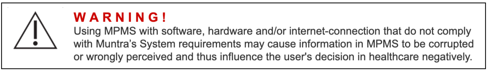
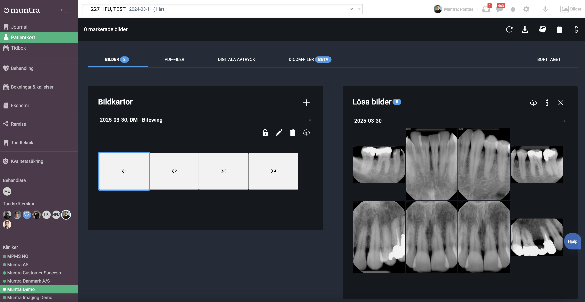
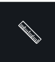

# Muntra Patient Management System (“MPMS”) Bruksanvisning (Instructions For Use)

| Dokumentnr | Datum för första utgåva | Senaste utgåva nr | Senaste utgåva datum |
| ---------- | ----------------------- | ----------------- | -------------------- |
| 15-01      | 23 okt 2019             | Rev3              | 19 maj 2022          |

En fysisk kopia av detta dokument ska betraktas som en "okontrollerad kopia". Innehavaren av en okontrollerad kopia ansvarar för att kontrollera dokumentets riktighet. Muntras interna hantering och granskning av dokument sker endast i den elektroniska versionen.

Om du vill få en utskriven version av bruksanvisningen (IFU), vänligen kontakta Muntra via e-post på support@muntra.se. Utskrivna kopior tillhandahålls kostnadsfritt på begäran.

Om du behöver detta dokument på ett annat språk, vänligen kontakta oss på support@muntra.se. Vi tillhandahåller en översatt version så snart som möjligt, i enlighet med lokala krav.

## 1. Märkning och symboler

**Publiceringsdatum:** 2025-03-30  
**Revisionsnummer:** Rev4

|                              |                                                                                                                                                                                                                                                   |
| ---------------------------- | ------------------------------------------------------------------------------------------------------------------------------------------------------------------------------------------------------------------------------------------------- |
|            | MPMS är en medicinteknisk produkt, CE-märkt i enlighet med Förordning (EU) 2017/745 (MDR).                                                                                                                                                        |
|  | **Tillverkare:** Muntra AB Narvavägen 12 115 22 Stockholm Sverige  Telefon: +46 (0)8-40 90 68 90 E-post: support@muntra.se Webbplats: https://muntra.se  **Tillverkningsdatum** visas i mjukvaran. |
|           | **Läs alla instruktioner före användning!**                                                                                                                                                                                                      |
|           | Katalognumret är MPMS Rev4.  Aktuell produktversion visas i mjukvaran (Version x.y.z).                                                                                                                                                      |
|       | V A R N I N G ! Denna symbol varnar för risk för skada, dödsfall eller andra allvarliga negativa reaktioner.                                                                                                                                  |
|       | F Ö R S I K T I G H E T ! Denna symbol varnar för risk för skada, dödsfall eller andra allvarliga negativa reaktioner.                                                                                                                         |

## 2. Viktiga säkerhetsföreskrifter

- Produkten måste installeras korrekt innan den tas i kliniskt bruk.
- Produkten får endast användas av behörig personal.
- Produkten får endast användas i enlighet med avsett ändamål.
- Läs bruksanvisningen före användning och följ alla säkerhetsföreskrifter.
- Eventuella incidenter eller skador på patient eller användare som kan ha orsakats av produkten ska rapporteras till tillverkaren eller distributören.

## 3. Produktbeskrivning

### 3.1 Produktvarianter

MPMS finns i två varianter.

- Version 1 är tillgänglig via webbläsare.
- Version 2 är en så kallad desktop-applikation.

Desktop-applikationen är utvecklad med samma kodbas som version 1. Syftet är att möjliggöra kommunikation mellan MPMS och röntgensensorer och/eller bildhanteringsprogramvara på användarens dator.

## 4. Regulatorisk information

MPMS är en medicinteknisk produkt klass IIa, CE-märkt enligt Förordning (EU) 2017/745 (MDR). Produkten uppfyller europeiska standarder enligt tabell 2.

**Tabell 2. Överensstämmelse med europeiska standarder**

| Standard                | Namn/Beskrivning                                                                                                                 |
| ----------------------- | -------------------------------------------------------------------------------------------------------------------------------- |
| IEC 62304:2015-06       | Medicinteknisk programvara – Processer för programvarans livscykel                                                               |
| IEC 62366-1:2015        | Medicintekniska produkter – Del 1: Tillämpning av användbarhetsingenjörskonst                                                    |
| ISO 13485:2016          | Ledningssystem för kvalitet – Krav för regulatoriska ändamål                                                                     |
| ISO 14971:2019          | Medicintekniska produkter – Tillämpning av riskhantering                                                                         |
| IEC 80001-1:2010-10     | Riskhantering för IT-nätverk med medicintekniska produkter – Roller, ansvar och aktiviteter                                      |
| ISO 27001:2013          | Informationsteknik — Säkerhetstekniker — Ledningssystem för informationssäkerhet — Krav                                          |
| MEDDEV 2.12/2 rev2      | Kliniska uppföljningsstudier efter utsläppande på marknaden                                                                      |
| MEDDEV 2.7/1 revision 4 | Klinisk utvärdering: Vägledning för tillverkare och anmälda organ                                                                 |
| Förordning (EU) 2017/745 (MDR) | Förordningen om medicintekniska produkter                                                                                         |

## 5. Avsett användningsområde

MPMS är avsett som ett verktyg för att stödja beslutsfattande och hantering av patientinformation inom tandvården, samt att innefatta en dental bildmodul för bildinsamling, lagring, bearbetning och diagnostik av dentala bilder.

### 5.1 Avsedd användare

Legitimerade tandläkare, legitimerade tandhygienister, tandvårdspraktiker och annan personal som assisterar vårdgivaren.

### 5.2 Avsedd patientpopulation

Tillämplig för alla tandvårdspatienter, oberoende av ålder, kön, vikt och hälsotillstånd. Muntra tillämpar inga begränsningar för patientmålgruppen.

### 5.3 Indikationer

Vid diagnostiskt bruk används produkten för att diagnostisera och dokumentera tillstånd såsom karies, parodontit, tand- och käkskador, inom ortodonti samt andra tillstånd i allmän- och specialisttandvård.

### 5.4 Kontraindikationer

Inga kända kontraindikationer.

### 5.5 Biverkningar

Primär oönskad effekt är felaktig diagnos som leder till felaktig behandling och/eller medicinering. Inga sådana händelser har noterats i kliniska studier eller post-market-uppföljning hittills. Risknivån bedöms som acceptabel.

### 5.6 Lagring

MPMS är inte en förbrukningsvara och har ingen hållbarhetstid. Produktens livslängd fortgår så länge tekniken är relevant för kliniskt behov.

### 5.7 Säkerhetsegenskaper

MPMS är kliniskt utvärderat för att inte negativt påverka patientsäkerheten när det används enligt avsett ändamål av legitimerad tandvårdspersonal. Systemet styr inte behandling direkt utan stödjer beslut genom att visa patientinformation och diagnostiska bilder. Primära risker rör **presentation av ofullständig, ändrad eller saknad information**.

Riskreducerande principer:
- **Tillgänglighet** – relevanta data och bilder finns tillgängliga vid behov.  
- **Spårbarhet** – alla åtgärder kan kopplas till specifik användare enligt lagkrav.  
- **Korrekthet** – skydd mot datakorruption/förlust via automatiska backuper, säkra åtkomster och redundant drift.  
- **Integritet/sekretess** – rollbaserad åtkomst och efterlevnad av GDPR och gällande cybersäkerhetsstandarder.

Ingen särskild utbildning krävs för säker användning, men stöd och dokumentation tillhandahålls.

### 5.8 Prestandaegenskaper

MPMS stödjer diagnostiskt beslutsfattande genom att användaren kan:
- Registrera och läsa strukturerade journaler,
- Hämta, visa och bearbeta dentala bilder,
- Dokumentera diagnoser och behandlingsbeslut.

Bildmodulen möjliggör:
- Bildinhämtning via kompatibla röntgenenheter,
- Lagring/organisering av PNG- och JPEG-filer,
- **Zoom, beskärning, rotation, spegelvändning och linjär mätning**.

### 5.9 Förväntade kliniska fördelar

- Förbättrat diagnostiskt stöd via bildverktyg (zoom, rotera, mäta).  
- Mer träffsäker behandlingsplanering och uppföljning via strukturerade data och tidsjämförelser.  
- Minskad felrisk genom mindre manuell hantering och färre systemspridningar.  
- Snabb åtkomst till patientinformation, även vid akuta situationer, via säker molnplattform.  
- Bättre patientutfall (mindre smärta, färre komplikationer, ökad livskvalitet).

## 6. Installation

Innan kliniskt bruk måste installation ske enligt <a href="https://support.muntra.se/installation/t/7">installationsanvisningarna</a>.

Installation görs på en eller flera datorer i nätverk, eventuellt kopplade till en gemensam server som lagrar röntgendatabas och bilder. Varje behandlingsrum har en arbetsstation med sensorer/kameror och nödvändig tredjepartsprogramvara (drivrutiner). I Muntra lagras inställningar centralt; arbetsstationer kan ha lokala tilläggsinställningar.

Välj rätt plugin för ansluten utrustning. Drivrutiner och plugin kan ha extra inställningar (t.ex. bildförbättring). Justeringar, kalibrering av röntgensystem och bildskärmskalibrering ska utföras enligt <a href="https://support.muntra.se/installation/t/7">anvisningarna</a> innan klinisk användning.

Se även <a href="https://support.muntra.se/installation/t/7">installation</a>, <a href="https://support.muntra.se/clinic-settings/t/9">klinikinställningar</a> och <a href="https://support.muntra.se/user-settings/t/8">användarinställningar</a>.

### 6.1 IT & Informationssäkerhet

Muntra prioriterar informationssäkerhet och följer branschpraxis. Åtkomst kräver MFA och verifieras mot centrala autentiseringstjänster. All kommunikation är krypterad.

Ingen känslig patientdata lagras lokalt; all behandling sker i Muntras molninfrastruktur hos certifierade leverantörer. Behörigheter hanteras centralt av klinikadministratör i enlighet med GDPR och övriga regelverk.

## 7. Bruksanvisning

### FÖRSIKTIGHET

Säkerhetskopior körs för närvarande nattetid, inte i realtid.

Nedan beskrivs grundfunktioner. Utseende/funktion kan variera beroende på inställningar och utrustning. All patientdata i exemplen är fiktiv.

### 7.1 Patienthantering

Skapa nya patienter, sök, redigera personuppgifter m.m.

#### 7.1.1 Patientsökning

Sökning finns alltid tillgänglig. Sök på namn, personnummer, adress, postnr, ort, telefon eller patient-ID. Ange minst två tecken. Välj patient genom att klicka på raden. Pilen i sökfältet visar dina 8 senaste sökningar.

### 7.2 Tidsbokning

Planering, schemaläggning, bokningar och kallelser, t.ex.:
- återbesökspåminnelser,
- skapa/redigera/ta bort bokningar,
- schemalägga e-post, SMS och brev för att öka närvaro.

Se <a href="https://support.muntra.se/time-management/t/6">tidshantering</a>.

### 7.3 Behandling

Planering, genomförande och uppföljning.

#### 7.3.1 Behandlingsplanering

Formulera plan för att förbättra patientens hälsa; patientunderlag och koppling till ersättningshantering.  
Se <a href="https://support.muntra.se/treatment-planning/t/16">behandlingsplanering</a>.

#### 7.3.2 Journalhantering

Skapa, lagra, redigera och ta bort journal enligt gällande lagar/regler.  
Se <a href="https://support.muntra.se/medical-records-management/t/14">journalhantering</a>.

#### 7.3.3 E-recept

Skapa och skicka elektroniska recept (gäller utvalda marknader).  
Se <a href="https://support.muntra.se/medical-prescription/t/10">e-recept</a>.

#### 7.3.4 Remisser

Dela remisser säkert mellan vårdgivare i MPMS, inkl. konsultationssvar.  
Se <a href="https://support.muntra.se/referral/t/19">remisser</a>.

#### 7.3.5 Röntgen

Sömlös integration mot röntgenprogram samt egen bildinfångning/hantering.

##### 7.3.5.1 Röntgen-UI

Öppna via bildikonen uppe till höger (gäller vald patient).  
- Vänster kolumn: strukturerade bildscheman (mounts).  
- Höger kolumn: enskilda bilder.  
Dubbelklicka för att öppna en bild.

##### 7.3.5.2 Bildmanipulering

Verktygsfält ovanför bilden + sidomeny till vänster innehåller bl.a. zoom, rotera, spegelvänd, beskär och mät.

I toppmenyn:
-  **Rotera:** varje klick roterar 90° medurs.  
-  **Spegelvänd:** horisontellt eller vertikalt.  
-  **Zoom:** klicka zoom-ikonen eller använd mushjulet.  
-  **Mät:** klicka och dra en linje; längd visas på bilden.

I vänstermenyn:
-  **Justera:** ljusstyrka, kontrast, mättnad, inversion, gråskala (dragreglage i realtid).  
-  **Beskär:** markera område och bekräfta.  
-  **Rita:** välj linjetjocklek/färg (om tillgängligt) och dra fritt på bilden.

##### 7.3.5.3 Kalibrera en bild

 Klicka på kalibreringsikonen. Klicka och dra en referenslinje över bilden. Ange verklig längd i dialogrutan; värdet används för att kalibrera mätningar i bilden.

#### 7.3.6 Filhantering

MPMS möjliggör snabb och säker lagring/säkerhetskopiering av dokument (t.ex. behandlingshistorik, ekonomi, myndighetskommunikation).  
Se <a href="https://support.muntra.se/file-handling/t/11">filhantering</a>.

### 7.4 Ekonomi

Hantering av ersättningar, fakturor och betalningar. Alla transaktioner återspeglas i organisationens bokföring/rapportering.

#### 7.4.1 Ersättningshantering (Claims)

Stöd för att ansöka om subventioner/ersättningar hos relevanta myndigheter.  
Se <a href="https://support.muntra.se/claims-handling/t/4">ersättningshantering</a>.

#### 7.4.2 Fakturering

Direktbetalningar och fakturor; hantering av kundfordringar, förskott m.m.  
Se <a href="https://support.muntra.se/invoicing/t/3">fakturering</a>.

#### 7.4.3 Bokföring

Fullt stöd för generering av bokföringsunderlag enligt lokala regler.  
Se <a href="https://support.muntra.se/accounting/t/13">bokföring</a>.

#### 7.4.4 Rapportering

Enkla och transparenta rapporter för att förbättra klinikens prestation.  
Se <a href="https://support.muntra.se/reporting/t/2">rapportering</a>.

### 7.5 Övrigt

#### 7.5.1 Inköp/Partners (Sourcing)

Tillgång till Muntras partnernätverk (t.ex. betal- och fakturatjänster). Modulen möjliggör hantering av dessa.  
Se <a href="https://support.muntra.se/sourcing/t/17">sourcing</a>.

## 8. Fel- och incidentrapportering

Om olycka/incident inträffar vid användning av MPMS, med skada på patient eller användare, eller om en situation uppstår där skada skulle kunna uppstå, ska Muntra AB omedelbart informeras för utredning och eventuell myndighetsrapportering.

Syftet med bruksanvisningen är att ge tillräcklig beskrivning för säker och effektiv användning. Det är viktigt att alla användare har läst och följer säkerhetsföreskrifterna. Meddela Muntra AB om fel eller brister upptäcks i dokumentet.

Användarstöd ges primärt av Muntra AB via telefon, e-post, chatt eller fjärruppkoppling.

### 8.1 Rapportering av allvarliga incidenter

Alla allvarliga incidenter vid användning av Muntra Journal ska rapporteras till tillverkaren och till behörig myndighet i det land där incidenten inträffat.

Enligt MDR (EU) 2017/745 avses bl.a. incident som direkt eller indirekt lett, kan ha lett eller kan leda till:
- dödsfall för patient, användare eller annan person,  
- tillfällig eller permanent allvarlig försämring av hälsotillstånd,  
- allvarligt hot mot folkhälsan.

I Sverige är behörig myndighet Läkemedelsverket (www.mpa.se).

### 8.2 Fel i ansluten utrustning

Olika leverantörers utrustning (sensorer, kameror m.m.) kan anslutas. Om utrustning inte kan anslutas eller inte fungerar: kontrollera först att den stöds och är korrekt installerad enligt <a href="https://support.muntra.se/installation/t/7">installationsanvisningarna</a>. Kontakta sedan leverantören/återförsäljaren för felsökning. Vid misstänkt fel i applikationen – kontakta Muntra AB.

### 8.3 Programfel (applikationsfel)

Vid applikationsfel visas ett felmeddelande med felkod. Informera Muntra AB för felsökning och produktförbättring. Alla applikationsfel loggas.

Vanliga fel beskrivs och löses i <a href="https://support.muntra.se/error-handling/t/20">Muntras felhantering</a> där så är möjligt.

## 9. Revisionshistorik

| Revisionsnr | Datum      | Beskrivning av ändring                                                                 | Godkänd av           |
|-------------|------------|----------------------------------------------------------------------------------------|----------------------|
| Rev0        | 2019-10-23 | Första utgåvan av IFU                                                                  | Niels Rask-Andersen  |
| Rev1        | 2020-11-18 | Uppdaterat avsett användningsområde, tillagd installationsvägledning                   | Niels Rask-Andersen  |
| Rev2        | 2021-07-05 | Tillagd CE-märkning, förtydligad märkning, uppdaterade säkerhetsföreskrifter           | Niels Rask-Andersen  |
| Rev3        | 2022-05-19 | Reviderad med medicinska symboler, uppdaterad produktbeskrivning                       | Niels Rask-Andersen  |
| Rev4        | 2025-03-30 | Övergång från MDD till MDR, tillagd säkerhets- & prestandainformation samt nyttobeskrivning | Pontus Green         |