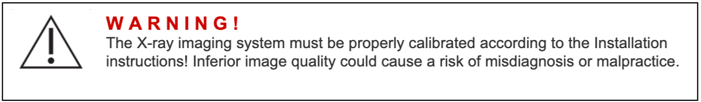

# Muntra Patient Management System (“MPMS”) Instructions For Use

| Doc. No. | Date of First Issue | Last Issue No. | Last Issue Date |
| -------- | ------------------- | -------------- | --------------- |
| 15-01    | 23 Oct 2019         | Rev3           | 19 May 2022     |

A physical copy of this document should be regarded as an "uncontrolled copy". The holder of an uncontrolled copy is responsible for checking the accuracy of the document. Muntra's internal handling and review of documents is only done in the electronic version.

If you would like to receive a printed version of the Instructions for Use (IFU), please contact Muntra by email at support@muntra.se. Printed copies are provided free of charge upon request.

If you require this document in another language, please contact us at support@muntra.se. We will provide a translated version as soon as possible, in accordance with local requirements

## 1. Labeling and Symbols

**Publication date:** 2025-03-30

**Revision number:** Rev4

|                              |                                                                                                                                                                                                                                                   |
| ---------------------------- | ------------------------------------------------------------------------------------------------------------------------------------------------------------------------------------------------------------------------------------------------- |
|            | MPMS is a medical device, CE-marked in accordance with Regulation (EU) 2017/745 (MDR)EEC.                                                                                                                                                                         |
|  | **Manufacturer:** Muntra AB Narvavägen 12 115 22 Stockholm Sweden  Phone: +46 (0)8-40 90 68 90 E-mail: support@muntra.se Website: https://muntra.se  The **date of manufacture** is shown in the software. |
|           | **Read all instructions before use!**                                                                                                                                                                                                             |
|           | The catalog number is MPMS Rev4.  Current product version is shown in the software (Version x.y.z).                                                                                                                                         |
|       | W A R N I N G ! This symbol alerts the user to the risk of possible injury, death or other serious adverse reactions.                                                                                                                          |
|       | C A U T I O N ! This symbol alerts the user to the risk of possible injury, death or other serious adverse reactions.                                                                                                                          |

## 2. Important Safety Precautions

- The product must be installed properly before being put into clinical use.
- The product may only be used by authorized personnel.
- The product may only be used in accordance with its intended use.
- Read the Instructions For Use before using the product and follow all safety precautions.
- Any incident or harm to a patient or operator that might be caused by the product must be
  reported to the manufacturer or distributor.

## 3. Product Description

### 3.1 Product Variants

MPMS is available in two variants.

- Version 1 is available through the browser.
- Version 2 is a so-called desktop application.

The desktop application is developed with the same code base as version 1.

The purpose of the desktop application is to enable MPMS to communicate with X-ray sensors and/or image management software on the user's computer.

## 4. Regulatory Information

MPMS is a Class IIa medical device, CE-marked according to Regulation (EU) 2017/745 (MDR). The product is in compliance with European standards according to table 2.

**Table 2. Compliance with European standards**

| Standard                | Name/Description                                                                                                              |
| ----------------------- | ----------------------------------------------------------------------------------------------------------------------------- |
| IEC 62304:2015-06       | Medical device software – Software life cycle processes                                                                       |
| IEC 62366-1:2015        | Medical devices - Part 1: Application of usability engineering to medical devices                                             |
| ISO 13485:2016          | Quality management systems – Requirements for regulatory purposes                                                             |
| ISO 14971:2019          | Medical Devices – Application of Risk Management to Medical Devices                                                           |
| IEC 80001-1:2010-10     | Application of risk management for IT-networks incorporating medical devices – Part 1: Roles, responsibilities and activities |
| ISO 27001:2013          | Information technology — Security techniques — Information security management systems — Requirements                         |
| MEDDEV 2.12/2 rev2      | Post-market Clinical Follow-up Studies                                                                                        |
| MEDDEV 2.7/1 revision 4 | Clinical Evaluation: A Guide for Manufacturers and Notified Bodies                                                            |
| Regulation (EU) 2017/745 (MDR) | Medical Devices Regulation                                                                                                     |

## 5. Intended Use

MPMS is intended to be a tool to support decision-making and management of patient information in dentistry treatments, and to contain a Dental Imaging Software intended for imaging acquisition, storage, manipulation and diagnosis of dental images.

### 5.1 Intended User

MPMS is intended to be used by licensed dentists, licensed dental hygienists, dental practitioners and other practitioners assisting the caregiver.

### 5.2 Intended Patient Population

MPMS is applicable to all types of dentistry patients. The intended purpose of the product is applicable regardless of age, gender, weight and health condition. Muntra does not apply any limitations to the patient target group.

### 5.3 Indications

When used for diagnostic purposes, the device will be used to diagnose and document diseases and conditions such as dental caries, periodontal disease, tooth and jaw injuries, in orthodontic treatment and other conditions that are encountered by general practitioners and specialists in the dental care field.

### 5.4 Contraindications

There are no known contraindications.

### 5.5 Side Effects

The primary undesirable side effect is a faulty diagnosis that leads to incorrect treatment and / or medication. No events of these potential side-effects have been recorded during the clinical trial, nor during the post-market clinical follow-up trial to date. The undesirable side-effects are considered acceptable.

### 5.6 Storage

MPMS is not a consumable device and thus has no shelf lifetime. The device lifetime is ongoing as long as the technology is applicable for the clinical need.

## 5.7 Safety Characteristics

The MPMS software has been clinically evaluated to verify that it does not negatively impact patient safety when used as intended by licensed dental professionals. The system does not control or influence medical treatment directly but supports clinical decisions by displaying patient information and diagnostic images. As such, the primary risks associated with MPMS involve the **presentation of incomplete, altered, or missing information**.

To mitigate these risks, MPMS has been developed and validated with the following key safety principles:

- **Accessibility**: Ensures that relevant patient data and images are always available when needed during treatment.
- **Traceability**: Enables clear attribution of all actions and changes in the system to specific users, fulfilling legal documentation requirements.
- **Correctness**: Protects against data corruption or loss by applying automated backups, secure access controls, and redundant hosting infrastructure.
- **Privacy**: Limits access to sensitive patient data based on user role and ensures compliance with GDPR and cybersecurity standards.

The intended user of MPMS is a qualified healthcare professional with clinical training. Therefore, **no special training is required to operate the software safely**, but user support and documentation are provided for onboarding and ongoing use.

## 5.8 Performance Characteristics

MPMS is intended to support diagnostic decision-making in dentistry by allowing the practitioner to:

- Access and record structured clinical notes,
- Acquire, view, and manipulate dental images,
- Document diagnoses and treatment decisions.

The system includes a fully integrated dental imaging module capable of:

- Acquiring images via compatible X-ray devices,
- Storing and organizing image files (PNG and JPEG formats),
- Performing image manipulations such as **zoom, crop, rotate, flip, and linear measurement**.

## 5.9 Expected Clinical Benefits

MPMS supports dental professionals in diagnosing and managing conditions such as dental caries, periodontal disease, and jaw injuries by providing integrated access to patient data and diagnostic images.

The key clinical benefits include:
- Improved diagnostic support through high-quality image acquisition and manipulation tools (zoom, rotate, measure).
- More accurate treatment planning and follow-up with structured records and time-based comparisons.
- Reduced risk of errors by minimizing manual data handling and system fragmentation.
- Faster access to patient information, including in emergency situations, via a secure, cloud-based platform.
- Enhanced patient outcomes, including reduced pain, fewer complications, and improved quality of life.

## 6. Installation

Before the product may be put to clinical use, it must be installed properly according to the <a href="https://support.muntra.se/installation/t/7">installation instructions</a>.

Installation is performed on one or several computers in a network. All computers may or may not connect to a common server that stores the X-ray software's database with patient information and images. Each computer in a treatment room is a workstation with connected equipment such as sensors and cameras as well as third party software such as drivers. In Muntra, settings are stored centrally. Each workstation may have additional settings that may be different between computers.

When installing a workstation, the correct plugins needed for the attached equipment are selected. The drivers for the equipment as well as the plugin may contain additional settings, e.g. for image enhancement. Adjustment of these settings, calibration of the X-ray imaging system and monitor calibration must be performed according to the <a href="https://support.muntra.se/installation/t/7">installation instructions</a> before clinical use takes place.

Refer to the instructions on <a href="https://support.muntra.se/installation/t/7">installation</a>, <a href="https://support.muntra.se/clinic-settings/t/9">clinic settings</a> and <a href="https://support.muntra.se/user-settings/t/8">user settings</a> for further details.

### 6.1 IT & Information Security 

Muntra places the highest priority on information security and follows industry best practices for protecting patient data and clinical workflows. While users are always encouraged to maintain strong security hygiene locally, the Muntra system is designed to protect against unauthorized access, even in the event of local vulnerabilities.

Access to Muntra requires secure multi-factor authentication (MFA), using an identity that is not stored locally on the device. Each login session is verified against Muntra’s central authentication servers. All communication between client devices and Muntra’s servers is encrypted.

No sensitive patient data is stored locally on client computers. All information within the system is processed and stored securely on Muntra’s cloud infrastructure, operated by certified providers that comply with applicable standards for security and availability.

Permissions and access levels are managed centrally by each clinic’s administrator. This allows for strict control of access to both patient and business-critical information, in accordance with GDPR and other applicable regulations.

## 7. Instructions for Use

### CAUTION

Backups are currently not performed in real time, but every night.

Below is a presentation of the basic functionality of the software. Please note that the appearance and functionality may differ depending on current settings and connected equipment. All patient information in the examples below is fictitious.

### 7.1 Patient Data Management

MPMS supports management of patient records and personal data. The user is able to create a new patient, find patients, edit personal information and more.

#### 7.1.1 Patient search

The patient search feature in Muntra is available at all times, regardless of where you are in the system. You can search for a patient using any of the following details: name, personal identity number, address, postal code, city, phone number, or patient ID.

To initiate a search, enter at least two characters. To select a patient from the list, simply click on the desired row.

As a logged-in user, you can also access a list of your 8 most recently searched patients by clicking the dropdown arrow in the search field. This allows for faster navigation and continuity in patient work.

### 7.2 Time Management

MPMS’ time management functionality covers tactical planning, scheduling of patient treatments, appointment management and appointment reminders. This includes e.g.

<ul>
- setting post-treatment appointment reminders for the patient
- creating, editing and deleting patient appointments
- creating and scheduling emails, text messages and mail to maximize the chance that the patient appears for the appointment
</ul>
Refer to the instructions on <a href="https://support.muntra.se/time-management/t/6">time management</a> for further details.

### 7.3 Treatment

MPMS’ treatment functionality encompasses a wide variety of treatment-related processes covering planning, execution and follow-up.

#### 7.3.1 Treatment Planning

MPMS’ treatment planning functionality aims to enable the formulation of a plan for improving the patient’s health status. This includes defining an easy-to-understand patient document describing the proposed treatment procedure. It includes planning and hence also relates to claims management.

Refer to the instructions on <a href="https://support.muntra.se/treatment-planning/t/16">treatment planning</a> for further details.

#### 7.3.2 Medical Records Management

MPMS’ provides support for caregivers to define, store, edit and remove medical records in accordance with applicable laws and regulations.

Refer to the instructions on <a href="https://support.muntra.se/medical-records-management/t/14">medical records management</a> for further details.

#### 7.3.3 Medical Prescription

MPMS’ e-prescription module enables the caregiver to create and send an electronic prescription that can instantly be expedited at any local pharmacy (selected markets apply).

Refer to the instructions on <a href="https://support.muntra.se/medical-prescription/t/10">medical prescription</a> for further details.

#### 7.3.4 Referrals

MPMS’ referral module enables the caregiver to instantly share referrals with any caregiver registered in MPMS. This includes secure, mutual consultation responses between e.g. general and specialist caregivers.

Refer to the instructions on <a href="https://support.muntra.se/referral/t/19">referrals</a> for further details.

#### 7.3.5 X-Ray

MPMS integrates seamlessly against applicable X-ray software solutions. Also, MPMS has its own image capture and image handling functionality.

##### 7.3.5.1 X-Ray User Interface

To open the Muntra X-ray interface, click the image icon located in the top-right corner of MPMS. This will launch the imaging view for the currently selected patient.

In this view, all previously captured radiographs and images for the patient are displayed. The interface is divided into two columns:
- The left column shows structured image mounts for easier comparison and diagnosis.
- The right column displays individual (“loose”) images that are not part of a mount.

This layout enables efficient review of historical images alongside new acquisitions.

To open an image, simply double click on that image. 

##### 7.3.5.2 Manipulating Images

In MPMS, you can easily manipulate dental images to support diagnosis and treatment. When an image is opened, you will see a toolbar above the image and an additional tool menu to the left.

These menus contain a variety of functions such as zoom, rotate, flip, crop, and measurement tools. Each icon represents a feature designed to help you adjust and interpret the image effectively.

In the top menu you will find:

 To rotate an image in MPMS, simply click on the rotate icon in the toolbar above the image. Each click will rotate the image 90 degrees clockwise. Repeat as needed to reach the desired orientation.

 To flip an image in MPMS, click on the flip icon in the toolbar above or beside the image. Use the horizontal flip icon to mirror the image left to right. Use the vertical flip icon to flip the image upside down.

 To zoom in or out on an image in MPMS, you can: Click the zoom icon in the toolbar above or beside the image to activate zoom mode. Use your mouse scroll wheel to zoom in and out directly.

 To measure distances in an image in MPMS click the measure icon in the image toolbar to activate the measuring tool. Then, left-click on the image, hold the button down, drag to your desired endpoint, and release to complete the measurement. The measured distance will appear as a line with values displayed directly on the image.

In the left menu, you will find:

 To adjust the image in MPMS, click the adjust icon in the image toolbar. This will open a menu with options for brightness, contrast, saturation, inversion, and greyscale. Click and drag the slider next to each setting from left to right or right to left to adjust the image to your preference. Changes are applied in real time, allowing you to fine-tune the image for optimal visibility.

 To crop an image in MPMS, click the crop icon in the image toolbar. Then, click and drag to select the area you want to keep. Confirm the crop to apply the change.

 To draw on an image in MPMS, Click the draw icon in the image toolbar. Choose your desired line thickness and color (if applicable). Left-click and drag on the image to draw freehand.

#### 7.3.6 File Handling

MPMS file storage capabilities enable caregivers to quickly and securely save and back up documents. This can relate to e.g. treatment history, financials and government communication.

Refer to the instructions on <a href="https://support.muntra.se/file-handling/t/11">file handling</a> for further details.

### 7.4 Financials

MPMS’ facilitates handling of claims, invoices and payments. All financial transactions are reflected in each organization’s accounting and reporting.

#### 7.4.1 Claims Handling

MPMS’ enables caregivers to make claims against government authorities, to ensure applicable subsidies are reimbursed correctly and securely.

Refer to the instructions on <a href="https://support.muntra.se/claims-handling/t/4">claims handling</a> for further details.

#### 7.4.2 Invoicing

MPMS’ invoicing functionality includes both direct patient payments and regular invoices. It enables a number of different features to create customer receivables, handle advance and up-front payments, and ensure the clinic is reimbursed effectively.

Refer to the instructions on <a href="https://support.muntra.se/invoicing/t/3">invoicing</a> for further details.

#### 7.4.3 Accounting

MPMS has full support for generating bookkeeping for the organization, in line with local laws and regulations.

Refer to the instructions on <a href="https://support.muntra.se/accounting/t/13">accounting</a> for further details.

#### 7.4.4 Reporting

Caregivers are able to improve performance for the organization and clinic, using simple and transparent reports.

Refer to the instructions on <a href="https://support.muntra.se/reporting/t/2">reporting</a> for further details.

### 7.5 Other

#### 7.5.1 Sourcing

Caregivers using MPMS gain access to Muntra partners that provide additional value-adding services. This includes e.g. payment and invoice service providers. MPMS’ sourcing module enables the management of these partners.

Refer to the instructions on <a href="https://support.muntra.se/sourcing/t/17">sourcing</a> for further details.

## 8. Reporting Problems

If an accident or incident occurs when MPMS is used, with injury to a patient or a user, or if a situation occurs where injury or malpractice could have occurred, Muntra AB must be notified immediately in order to investigate the event and to report the incident to the authorities.

The purpose of these instructions for use is to provide a sufficient description of the product to be put to its intended use in a safe and efficient way. It is important that all users of the system have read the instructions for use and follow all safety precautions. If errors or omissions are discovered in the instructions for use, kindly notify Muntra AB.

User support is primarily provided by Muntra AB via telephone, e-mail, chat messaging or remote connection to solve problems.

### 8.1 Reporting of serious incidents

All serious incidents involving the use of Muntra Journal must be reported to the manufacturer and to the competent authority in the country where the incident occurred.

According to Regulation (EU) 2017/745 (MDR), a serious incident is defined as any incident that directly or indirectly led, might have led, or could lead to any of the following:
- The death of a patient, user, or another person,
- A temporary or permanent serious deterioration of a patient’s, user’s, or another person’s state of health,
- A serious public health threat.

In Sweden, the competent authority is the Medical Products Agency (Läkemedelsverket). Contact details are available at www.mpa.se.

### 8.2 Errors in Connected Equipment

A variety of equipment from other vendors can be connected to Muntra, such as sensors and cameras. If the equipment cannot be connected or is not working properly, first check that it is supported by MPMS and that it has been properly installed according to the <a href="https://support.muntra.se/installation/t/7">installation instructions</a>. Then contact the distributor who supplied or installed the equipment for troubleshooting. If the problem seems to be due to an error in the application, contact Muntra AB.

### 8.3 Application Errors

If an application error occurs in MPMS, a special error message with an error code is displayed. It is important to notify Muntra AB for troubleshooting so the product can be improved. All application errors are stored in a log.

Additionally, the most common errors are explained and if possible resolved in <a href="https://support.muntra.se/error-handling/t/20">Muntra's error handling</a>.

## 9 Revision History

| Revision No. | Date       | Description of Change                                                                   | Approved By            |
|--------------|------------|------------------------------------------------------------------------------------------|-------------------------|
| Rev0         | 2019-10-23 | Initial release of the IFU                                                               | Niels Rask-Andersen     |
| Rev1         | 2020-11-18 | Updated intended use, added installation guidance                                        | Niels Rask-Andersen     |
| Rev2         | 2021-07-05 | Added CE mark, labeling clarification, updated safety precautions                        | Niels Rask-Andersen     |
| Rev3         | 2022-05-19 | Revised to include medical symbols, updated product description                          | Niels Rask-Andersen     |
| Rev4         | 2025-03-30 | Transitioned from MDD to MDR, added safety & performance information, expected benefits.  | Pontus Green     |

